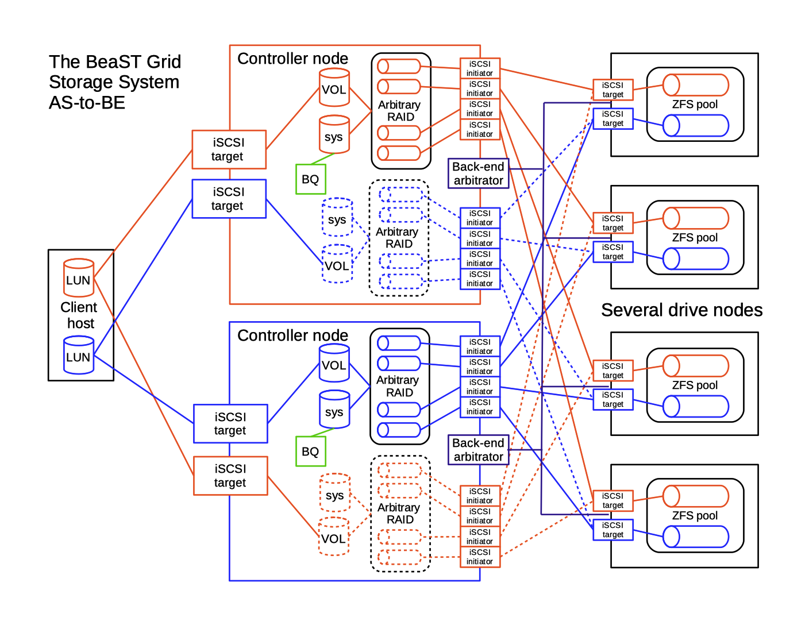

# BeaST

The BeaST is the FreeBSD based reliable storage system concept, it consists of two major families: the **BeaST Classic** and the **BeaST Grid**.

The **BeaST Classic** family has dual-controller architecture with RAID Arrays or ZFS storage pools. It turns two commodity servers into a pair of redundant active-active/asymmetric storage controllers which use iSCSI protocol (Fibre Channel in the future) to provide clients with simultaneous access to volumes on the storage system. Both controllers have access to all drives on one or several SATA or SAS drive enclosures. Depending on particular configuration, it allows the BeaST Classic to create wide range of GEOM based software or hardware RAID array types along with ZFS storage pools.

The BeaST Classic uses BeaST Quorum (BQ) software in conjunction with CTL High-Availability (CTL HA) or the BeaST Arbitrator (BA) for the fail-over and fail-back operations.

| The BeaST Classic with RAID Arrays                                   |
| -------------------------------------------------------------------- |
| [BA + BQ](documentation/the_beast_classic_raid_ba_bq-1-1.pdf)        |
| [CTL HA + BQ](documentation/the_beast_classic_raid_ctlha_bq-1-1.pdf) |

| The BeaST Classic with zpools |
| ------------------------------|
| BA + BQ                       |
| CTL HA + BQ                   |

The **BeaST Grid** family utilise computer nodes instead of drive enclosures.

| The BeaST Grid with RAID arrays                               |
| --------------------------------------------------------------|
| [CTL HA + BQ](documentation/the_beast_grid_raid_ctlha_bq.pdf) |
| BA + BQ                                                       |

| The BeaST Grid with zpools                                    |
| ------------------------------------------------------------- |
| CTL HA + BQ                                                   |
| BA + BQ                                                       |

## Current documentation

[The BeaST Grid with RAID arrays and CTL HA](documentation/the_beast_grid_raid_ctlha_bq.pdf)
[Configuring Linux server to work with the BeaST storage system over iSCSI protocol Version 1.1, 2018.10.26](documentation/configuring-linux-server-to-work-with-the-beast-storage-system-over-iscsi-protocol_1-1.pdf)
[The BeaST Classic – dual-controller storage system with ZFS and CTL HA](documentation/the_beast_classic_zfs_ctlha_bq-szfs_1-1.pdf)
[The BeaST Classic – dual-controller storage system with RAID arrays and CTL HA Version 1.1, 2018.06.03](documentation/the_beast_classic_raid_ctlha_bq-1-1.pdf)
[Approaching online zpool switching between two FreeBSD machines](documentation/approaching-online-zpool-switching-between-two-freebsd-machines_1-1.pdf)
[The BeaST Classic – dual-controller storage system with RAID arrays and fail-over Arbitrator mechanism](documentation/the_beast_classic_raid_ba_bq-1-1.pdf)
[Simple quorum drive for the FreeBSD CTL HA and the BeaST storage system](documentation/simple-quorum-drive-for-the-freebsd-ctl-ha-and-the-beast-storage-system.pdf)
[The BeaST Quorum device source code Download BeaST Quorum](documentation/)
[First look at the renewed CTL High Availability implementation in FreeBSD Version 1.1, 2016.10.20](documentation/first-look-at-the-renewed-ctl-high-availability-implementation-in-freebsd-v1-1.pdf)
[Using SSD as the level two cache for the FreeBSD dual-controller storage array 2016.07.21](documentation/using-ssd-as-the-level-two-cache-for-the-freebsd-dual-controller-storage-array.pdf)

[Archive documentation](documentation/archive)
